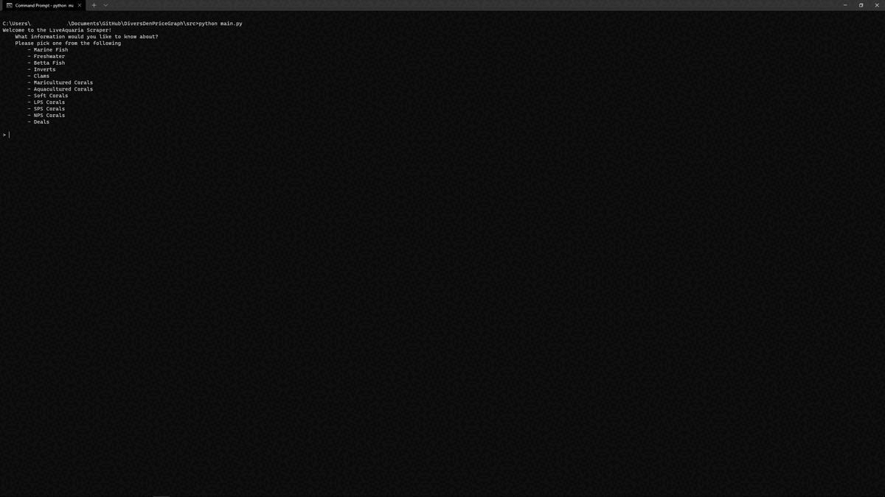

# Divers Den Price Graph

### Displays a graph of animals currently for sale in the Live Aquaria Diver's Den

Project created for Network Programming final project.

## Prerequisites
- python >= 3.10  
- urllib
- pandas
- matplotlib

##  Demo

## Installation
Make sure you have the python modules installed.

Save project onto your own system and run it directly from the source folder

## 🤝 Credits
Aria Hogan - hoganc3@wit.edu
Vianne Shao - shaov@wit.edu

## 📝 License
Copyright © 2021 Aria Hogan and Vianne Shao.
This project is [MIT](https://github.com/hoganc3/DiversDenPriceGraph/blob/main/LICENSE) licensed.
